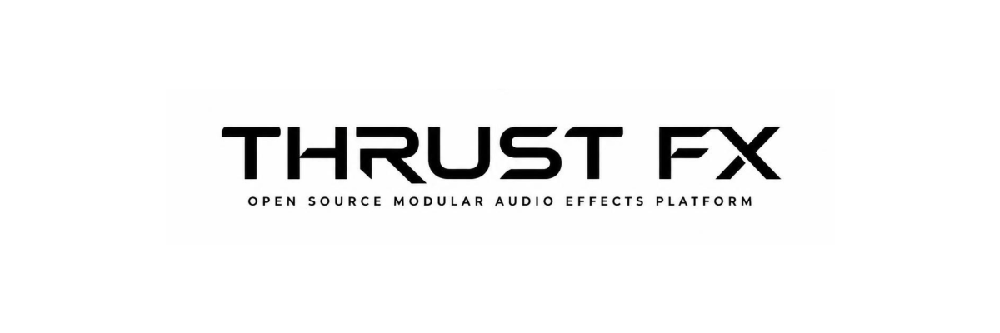

<p align="center">
  
</p>

<p align="center">
  <strong>Open source modular multi-effects pedalboard</strong>
</p>

<p align="center">
  Build your own professional-grade digital effects processor.
</p>

<a align="center">


  <a href="LICENSE" target="_blank" rel="noopener noreferrer">
    
  </a>
  <a href="https://github.com/Thrust-FX/Thrust-FX/pulls" target="_blank" rel="noopener noreferrer">
    
  </a>
  <a href="https://github.com/Thrust-FX/Thrust-FX/issues" target="_blank" rel="noopener noreferrer">
    
  </a>
  <a href="https://discord.gg/H3cKCquPex" target="_blank" rel="noopener noreferrer">
    
  </a>
</a>

---

## 🎸 About the project

**THRUST FX** is an open source DIY multi-effects pedalboard project designed to give musicians, makers and developers the ability to build, customize and extend their own professional digital effects platform.

The goal is to create a modular ecosystem combining:

* 🎛️ Custom hardware
* 🎚️ Digital audio processing
* 💻 Open source software
* 🔌 Extensible SDKs
* 🌍 Community-created effects and presets

THRUST FX is not designed as a closed commercial product. The objective is to provide a platform that anyone can build, modify and improve.

---

# ✨ Features

## Hardware

* Modular pedalboard architecture
* Multiple hardware configurations
* Support for different numbers of:

  * Footswitches
  * Expression pedals
  * Displays
  * Controllers

Example configurations:

* Compact version
* Standard version
* Professional version

---

## Controls

The platform is designed around a powerful control system:

* Up to 36 footswitches

  * 32 assignable effect switches
  * 4 navigation switches

* Dedicated display system:

  * Main navigation screen
  * Individual screens for effects

* Multiple rotary encoders and physical controls

---

## Audio processing

Features planned:

* Digital effect chain management
* Customizable signal routing
* Master EQ
* Per-chain EQ
* Preset management
* Custom effect creation system

---

## Effects ecosystem

THRUST FX aims to support:

* Digital recreations of legendary effects
* Original community-created effects
* User-defined signal processing
* Custom effect development

---

## Expression controls

Support for:

* Wah pedal
* Volume pedal
* Whammy-style pitch control
* Adjustable expression mappings

---

## Connectivity

Planned features:

* WiFi connectivity
* Online preset library
* Remote preset installation
* Community sharing platform

---

# 🏗️ Project architecture

THRUST FX is a multi-language open source project.

```
THRUST FX

├── firmware/      Embedded systems and hardware control
├── software/      Main audio engine and applications
├── hardware/      Schematics, PCB and mechanical design
├── sdk/           Developer SDKs
├── cli/           Command line tools
├── tools/         Development utilities
├── website/       Project website
├── docs/          Documentation
└── specs/         Technical specifications
```

---

# 🧑‍💻 Development

## Requirements

Coming soon.

The project will use:

* C/C++ for embedded systems and audio processing
* TypeScript/JavaScript for web tooling and applications
* Python and other languages through SDK integrations

---
## Tools
## Links

- [TypeScript](https://www.typescriptlang.org) ([GitHub](https://github.com/microsoft/TypeScript/#readme))
- [PNPM](https://pnpm.io/) ([GitHub](https://github.com/pnpm/pnpm))
- [ViteJS](https://vite.dev) ([GitHub](https://github.com/vitejs/vite))
- [Vercel](https://vercel.com) ([GitHub](https://github.com/vercel/vercel))
- [React](https://react.dev) ([GitHub](https://github.com/facebook/react))
- [ESLint](https://eslint.org) ([GitHub](https://github.com/eslint/eslint))
- [Prettier](https://prettier.io) ([GitHub](https://github.com/prettier/prettier))
- [Commitlint](https://commitlint.js.org) ([GitHub](https://github.com/conventional-changelog/commitlint))
- [Husky](https://typicode.github.io/husky/) ([GitHub](https://github.com/typicode/husky))
- [Lint Staged](https://www.npmjs.com/package/lint-staged) ([GitHub](https://github.com/lint-staged/lint-staged))

---

## Getting started

Clone the repository:

```bash
git clone https://github.com/Thrust-FX/Thrust-FX.git

cd thrust-fx
```

Install dependencies:

```bash
pnpm install
```

Run development tools:

```bash
pnpm dev
```

---

# 🤝 Contributing

Contributions are welcome!

Whether you are interested in:

* DSP programming
* Embedded development
* Electronics
* UI/UX
* Documentation
* Hardware design
* Testing

everyone can help improve THRUST FX.

Please read:

* [Contributing Guide](./.github/CONTRIBUTING.md)
* [Code of Conduct](./.github/CODE_OF_CONDUCT.md)

before contributing.

---

# 🗺️ Roadmap

## Phase 1 — Foundation

* [x] Repository setup
* [x] Development environment
* [ ] Website
* [ ] Project specifications
* [ ] Hardware architecture
* [ ] Software architecture

## Phase 2 — Prototype

* [ ] First hardware prototype
* [ ] Audio engine prototype
* [ ] Basic effects
* [ ] Preset system

## Phase 3 — Community platform

* [ ] SDK release
* [ ] Effect development documentation
* [ ] Preset sharing
* [ ] Community contributions

---

# 📜 License

THRUST FX is open source and licensed under the [Apache License 2.0](./LICENSE).

---

# ❤️ Support the project

If you like the idea behind THRUST FX:

* Star the repository
* Share the project
* Contribute code or documentation
* Build your own version
* Help improve the ecosystem

---

<p align="center">
  Made with passion for musicians, makers and open source communities.
</p>
